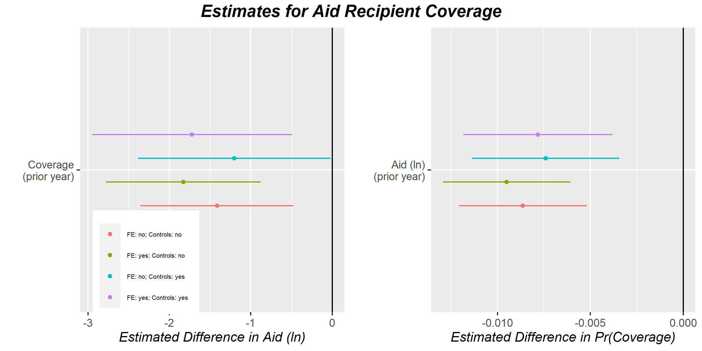

**Keywords**: Foreign Aid, Foreign Policy, China, Xinua, News Media

# Introduction
A growing number of scholars are wading into the still largely unexplored frontier that lies at the intersection of domestic political communication and foreign policy. On this front, researchers such as Rioux and Van Belle (2005) argue that news media play a significant role in shaping a country’s foreign policy. Focusing on the issue of foreign aid allocation, Rioux and Van Belle specifically contend that news coverage of individual impoverished countries increases the “domestic political imperative” to prioritize foreign aid to these countries vis-à-vis countries that receive less media attention. In support of this expectation, Rioux and Van Belle find a significant positive association between frequency of country mentions in *Le Monde* (a prominent news media source in France) and French bilateral aid allocations. Van Belle and Hook (2000) find similar results in the U.S. context, while Potter and Van Belle (2009) find a positive correlation between news coverage of natural disasters and disaster aid from Japan. Taken together, these studies support the view that news media play a significant role in shaping foreign policy outcomes generally, and in shaping foreign aid allocations in particular. 

*But how well does this translate to a non-democratic context?* China is a rising star in the world of international development. It also is an authoritarian polity with a tightly controlled media environment. The Chinese case provides an opportunity to assess whether the link between media coverage and foreign aid allocation found in democratic donors exists in authoritarian donors as well and, if such a pattern exists, whether news coverage drives “domestic political imperative” or is driven by top-down foreign policy objectives.

This study therefore asks two questions: (1) is there a significant positive association between coverage of impoverished countries in Chinese news media and bilateral Chinese aid flows, and (2) if such a correlation exists, in which direction does the causal arrow point? While the first question should be easy enough to answer, the second will prove a challenge. One can make the reasonable case that news coverage of foreign affairs in a democratic polity has a significant effect on foreign policy, but the influence of news media (especially of major news outlets) in an authoritarian context is likely limited. Even more, the foreign policy objectives of ruling elites may drive much of the news media’s content---content that tends toward pro-government framing of international events (see Baum and Zhukov 2015). If so, one imagines that what coverage of foreign affairs does appear in the news is meant to instill support among the public for existing policies. 

Even more interesting for the Chinese case, prominent news providers such as *Xinhua* have multilingual versions which are often targeted toward a foreign audience; not a domestic one. Thus, Chinese news media may more frequently cover issues in countries that receive foreign aid from China to promote, not only domestic, but also foreign audience approval of the state’s development cooperation initiatives. The broader implication of this insight is that in authoritarian regimes, rather than the media playing an agenda-setting role in shaping foreign policy as Rioux and Van Belle (2005) contend, the state instead plays an agenda-setting role in news coverage.

To estimate the association between news coverage and aid allocation in the Chinese context, and to further tease out whether the latter affects the former (or vice versa) I adopt the following strategy. Using the Archer Data Sleuth Portal developed by the Cline Center at the University of Illinois at Urbana-Champaign, I obtain metadata on yearly country mentions in the English version of *Xinhua* (China’s official state-run media and the largest and most influential news provider in the People’s Republic of China), which I merge with AidData’s Global Chinese Official Finance Dataset (2000-2014). 

To gain insight into whether news media influence China’s bilateral aid allocations or, as I suggest above, China’s aid allocations influence news coverage, I propose two strategies. First I use the time-series dimension of the data to assess the temporal relationship between bilateral aid allocations and aid recipient coverage in *Xinhua*. If coverage of a country in one year is followed by a significant increase in aid allocated to that country in the following year, this would support the idea that media has agenda-setting influence on Chinese aid policy. Conversely, if aid allocation is followed by a significant increase in the probability of media coverage, this would support the idea that state policy shapes the agenda of news media. To ensure the robustness of these results, I include year fixed effects to control for unobserved yearly shocks to China's aid policy and news coverage and a set of covariates that may be correlated both with aid allocations and with news coverage. 

For the second strategy, I leverage metadata provided by Archer on the sentiment of *Xinhua* articles that mention aid recipients. I rely on three different measures of net sentiment based on the following lexicons: (1) the Bing Liu lexicon, (2) the General Inquirer lexicon, and (3) the Lexicoder Dictionary. Under the assumption that negative sentiment is associated with coverage of developing country problems, I expect that if more net negative sentiment in articles that mention aid recipients leads to greater aid to that recipient the following year, this is consistent with the domestic political imperative view of the role of media in shaping foreign aid policy. Conversely, I assume that if greater aid to a recipient is followed by greater net positive sentiment, this is indication of positive framing of China’s development policy (plausibly at the behest of ruling elites). Though far from conclusive, positive versus negative framing of aid recipients should hint at the direction of the causal arrow linking media coverage of aid recipients to Chinese aid allocations. 
	
Though the above hypotheses seem reasonable, as the results will show, the data deviate in important ways from expectations. While the analysis ultimately supports a top-down perspective linking media and foreign aid policy in China, I find a *negative* association between receipt of Chinese aid and the probability of recipient coverage in *Xinhua* the following year. Further, I find that the relationship between aid and coverage sentiment is highly dependent upon the lexicon used. Results are consistent with the view that sentiment lacks a strong effect on future aid flows, but depending on the sentiment measure, I find that greater aid leads to either no effect, a negative effect, or a positive effect on net sentiment in country-specific coverage the following year (the latter two findings are not robust to year fixed effects, however). Taken together, these findings suggest that elites prefer to avoid coverage of China's foreign aid recipients while preference for positive or negative coverage of events in recipients remains unknown.
	
This study’s findings contribute to the growing literature on the role of media in foreign policy, and in particular this study’s focus on China offers a new perspective on the link between news coverage and aid policy in this as yet unexplored authoritarian context. This study lends support to Rioux and Van Belle’s claim that “the role of news media should be part of any comprehensive model of foreign aid and foreign policy” (2005, 482). But even more, this study’s findings add to the above claim that regime type also should be incorporated into any comprehensive model for such a model to be considered truly comprehensive. The nature of the association between media coverage of aid recipients and Chinese aid flows is consistent with top-down influence on whether the media covers aid recipients. The implications of this finding are unknown, but at the very least it seems that ruling elites want to deemphasize their development cooperation policy for both their own citizens and foreign audiences alike. The import of donor regime type will only increase as China expands its aid program and as other non-democratic donors such as Russia and the United Arab Emirates expand their aid programs as well. As a recent report by the Overseas Development Institute finds, these new donor countries allocate aid in ways that differ markedly from long-standing donors like the United States and France (Gulrajani and Swiss 2017). A thorough assessment of the determinants of these differences will require peering into the black box of domestic politics and the communication environments that serve as the nerve endings of these countries’ political institutions. Further analysis is also warranted if we wish to know why Chinese elites prefer to keep their aid recipients out of the media spotlight.

# What We Know about the Links between Media and Foreign Aid
The so-called "CNN effect," highlights the influence of news media on foreign policy intervention. According to Robinson (2002), the advent of 24 hour news cycles saturated Western audiences with non-stop images of conflicts and poverty abroad, prompting bottom-up demand for intervention. But while intervention in the form of military deployments captures the popular imagination, one of the most ubiquitous and important tools at the disposal of intervening countries is foreign aid. Though scholars remain divided over aid donor motives, most researchers would agree that wealthy countries give aid to poor countries as a means to alter some undesirable state of affairs in the recipient (Palmer and Morgan 2006). This undesirable state of affairs might be policies that fail to align with donors' (see, Bueno de Mesquita and Smith 2009), recipient neediness (Lumsdaine 1993), or international spillovers of developing country problems (Bermeo 2017 and 2018).

Media influence on foreign aid policy represents a niche research agenda within the broader foreign aid literature, but despite limited studies, existing work provides telling results. Van Belle and Hook (2000) show that news coverage from 1977 to 1992 had a significant effect on U.S. aid commitments. The authors contend that this association follows from the calculations of foreign policy officials who anticipate news coverage of international affairs having an effect on public perception of the importance of particular foreign policy issues. Beyond the U.S. context, Rioux and Van Belle (2005) find that coverage of developing countries in the prominent French news media outlet *Le Monde* correlates with greater French foreign aid to those countries in a given year. This finding holds even when controlling for whether the recipient is a former colony or francophone, two factors that would both lead to greater coverage of particular countries and greater French aid. Outside of the traditional Western countries, Potter and Van Belle (2004) find a similar media effect in Japan.

More studies exist beside those above, but they paint a similar picture: news media coverage raises the salience of particular foreign policy issues (e.g., problems in developing countries) prompting domestic political imperative to intervene (allocation of greater foreign aid). The consistency of this finding highlights the importance, as Rioux and Van Belle (2005) state, of including media in "any comprehensive model of foreign aid and foreign policy" (482). However, the fact that existing studies only consider the role of media in foreign aid policy in democratic contexts throws a massive monkey wrench into the tidy story given above. The influence of domestic political imperative hinges on policymakers having incentive to respond to citizen preferences. But what happens in an authoritarian environment with state-run media?

As the People's Republic of China joins the ranks of the international donor community, many of China' aid projects have gained international attention (and ire) given their links with the country's ambitious and controversial Belt and Road Initiative. That China's state-run media has a role to play in China's foreign investment and infrastructure projects is a safe bet, but there are reasons to doubt that news media has significant influence over whether and where China targets its resources. Though no studies to date (to this author's awareness) have examined links between Chinese media and China's foreign aid program, scholars have peered into China's media environment in the context of other issue areas. These studies demonstrate that the Chinese government exerts no small measure of control over content and framing in news media. In a telling comparative analysis, Wu (2006) finds marked differences in coverage of HIV/AIDS in China by the Associated Press in the United States vis-$\grave{\text{a}}$-vis *Xinhua*, China's (and the world's) largest news media provider. While AP expressed an anti-(Chinese)-government frame in its coverage, *Xinhua*'s coverage was overwhelmingly pro-government. Li, Brewer, and Ley (2017) find a similar pro-government spin in *Xinhua*'s coverage of SARS and Ebola. The authors' analysis shows, in particular, that coverage highlighted the Chinese government's ostensibly successful management of SARS at home and fight against Ebola abroad. Li, Brewer, and Ley (2017) note that these findings indicate the unmistakable influence of government preferences over news media in China. Whether China's government has similar influence over coverage of recipients of China's foreign aid is unknown, but a likely scenario. Discussion of the patterns in news coverage of recipients is the subject of the next section.

# Media's Role in China's Foreign Aid Policy
Given the discussion in the previous section, Chinese government influence over state-run media such as *Xinhua* has implications for the role of media in China's foreign aid policy that are unique to an authoritarian context. Rather than news coverage of issues driving domestic political imperative to respond, news coverage more likely follows the policy objectives of elites. To borrow the popular metaphor, *Xinhua* acts more as lapdog than watchdog. This fact raises questions about the transferability of concepts such as domestic political imperative and of models of foreign policy that give media coverage a causal role in shaping foreign policy outcomes to non-democratic polities. 

The authoritarian context of China's foreign aid program calls for a modified framework, one that includes media as a meaningful part of foreign policy but that accounts for state influence over media content and framing. The short version of what this modified model implies for the relationship between media coverage and foreign aid is that, unlike in a democratic country, China's foreign aid policy ought to determine media coverage; not the other way around.

This expectation, ironically, follows from presumptions about the role of media in democratic polities. For scholars such as Van Belle (1993), news media perform a pivotal informational function, providing citizens, interest groups, and policymakers information about foreign policy events and issues. In turn, this information serves as fodder for the formation of political opinions and as the basis for policy evaluations and choices by elected officials. But even more, policymakers anticipate coverage of their foreign policy actions in the media and weigh the expected positive or negative publicity of possible policy choices before taking a course of action. Positive coverage is expected to lead to popular support for foreign policies; negative coverage is expected to lead to criticism and political losses. Though not explicitly noted by Van Belle (1993), one imagines that this dynamic forms a cycle where media cover foreign policy events in either a positive or negative light, this shapes citizen opinions and policymaker evaluations and responses, policymakers then either continue certain policies or adjust in anticipation how their choices will play in the news media, and the media then covers new events and the cycle continues. This pattern bears resemblance to Entman's (2003) cascade model which consists of feedback loops among elites, media, news frames, and public opinion.

Regardless of the specific model, the presumption most relevant to the Chinese context is that media coverage and framing have an impact on public opinion. In turn, public support of, or resistance to, foreign policies can make the difference between political wins or losses. Though the media cycle in China should differ in important ways from that in democracies such as the United States and Japan, the potential of media to generate friction for elites as they implement foreign policies is surely not lost on Chinese officials. For this reason, we should expect that prominent state-run media will cover foreign policy events and issues according to the preferences of ruling elites and do so in a way that puts a positive spin on foreign activities. This should further be the case regardless of whether the anticipated audience is domestic or foreign. Chinese state-run media has a global reach and is produced in several languages, including English, French, German, etc. Elites likely care not only about domestic public opinion, but also about the public opinion of foreign audiences.

So what does this imply for news coverage and China's foreign aid policy? I contend that elite concerns about coverage and framing of foreign policy activities implies two expectations in the context of foreign aid. First, state-run media should disproportionately cover aid recipient countries. Second, coverage of aid recipients should be disproportionately positive. These hypotheses are complementary, as elites should see utility in coverage of China's aid projects, especially when that coverage has a positive spin---much like *Xinhua* coverage of Ebola that framed the state's response in terms of success (Li, Brewer, and Ley 2017). Stated formally, this implies the following hypotheses:

> $H_1$: Greater foreign aid to a particular recipient should have a positive association with coverage of that recipient.

> $H_2$: Greater foreign aid to a particular recipient should lead to more positive coverage of that recipient.

It bears noting that the above hypotheses imply another set of expectations for news coverage and foreign aid: that media coverage should not influence when and where China targets its foreign aid. Teasing out the unidirectional effect of foreign aid policy on media coverage is no easy task, but as will be detailed in a later section, evidence for the direction of aid policy's effect can be provided by modeling past aid allocations on future media coverage and comparing results to past media coverage on future aid allocations. If estimates in the former case are statistically significant, and insignificant in the latter case, this should count as evidence against media having influence on aid policy and in favor of aid policy having influence on media coverage. Data and methods used to test these expectations is the subject of the next section.

# Data and Methods
To test hypotheses 1 and 2, I take advantage of two newly available datasets. First, I use AidData's Global Chinese Official Finance Dataset (version 1.1), which contains data on bilateral Chinese aid and non-concessional official financing from 2000 to 2014 (Dreher et al. 2017). Born of a rigorous effort that triangulates official Chinese financing using open-source information, AidData's coverage of Chinese aid represents an important contribution and the penultimate resource for information on bilateral Chinese aid. From this database I create the variable Aid$_{it}$, which is a log-transformed measure of Chinese aid (plus 1) to a given developing country $i$ in a given year $t$. I use the transformation $\ln(x + 1)$ to correct for the highly skewed distribution of Chinese aid flows while ensuring that zero values are preserved.

Second, I use the Archer data portal provided by the Cline Center for Advanced Social Research at the University of Illinois at Urbana-Champaign (Cline Center 2019). Archer is a web application for accessing extracted features of the Cline Center's Global News Index, a database containing tens of millions of historical news reports from a variety of major news outlets across the globe, including a corpus of 3.9 million Xinhua General News Service articles from January of 1977 to August of 2019. The query system works by allowing users to input certain keyword searches, as well as geolocation filters, which returns a dataset of user selected extracted features of relevant articles, including publication date; title; publisher ID; mentions of countries, locations, people, and organizations; and extracted sentiment expressed in articles obtained via several popular and validated sentiment dictionaries. Using this database, I query all articles from the BulkLexisNexis Corpus from January 2000 to December 2014, and restrict my analysis to articles published by *Xinhua*. Given limitations on the file size of downloadable datasets, I narrow the data query to articles that explicitly mention "foreign aid." Extracted features in my data download include names of countries mentioned in articles, date of publication, and positive and negative sentiment of articles as measured by three sentiment lexicons: the lexicon developed Bing Liu, Harvard University's General Inquirer, and the Lexicoder Sentiment Dictionary. 

With this data I create a variable called Coverage$_{it}$, which is a 0-1 indicator for whether in a given year an aid recipient is covered by a *Xinhua* article that mentions foreign aid. I use an indicator instead of a count measure since yearly coverage totals per country range between only 0 and 5, with the distribution highly skewed toward totals in the 0-1 range. Since the greatest variation in coverage is between 0 and 1, I prefer to use an indicator for coverage to avoid adding additional noise in model estimation. 

I further create the variable Sentiment$_{it}$ based on each of the individual sentiment measures mentioned above. For a given lexicon, I take the measure of positive sentiment minus negative sentiment in a given article and then estimate the yearly average sentiment of articles that cover each aid recipient country. This yields a unique net sentiment score per each aid recipient per year. To facilitate comparability among measures, I convert values to standard deviation units per each year.

To control for the confounding influence of variables that may both influence Chinese aid allocations and *Xinhua* coverage, I include measures of recipient population, average income, employment rate, democracy, and bilateral trade with China. I pull from version 8.1 of the Penn World Table (Feenstra, Inklaar, and Timmer 2015) to create the variables Population$_{it-1}$, Income$_{it-1}$, and Employment$_{it-1}$, which denote log-transformed values of the one year lags of recipient population, gross domestic product (GDP) per capita, and employment rate (individuals engaged per country population) respectively (coverage goes from 1950 to 2011). From the Quality of Governance Institute Dataset (Dahlberg et al. 2019) I obtain the measure Democracy$_{it-1}$ based on the V-dem (Varieties of Democracy) measure of democratic governance (based on a continuous scale from 0 to 1). For the variable Trade$_{it-1}$, I take the natural log of the smoothed bilateral trade measure from the Correlates of War International Trade dataset, version 4.0 (Barbieri and Keshk 2016). To further adjust for unobserved yearly shocks, I include a set of year indicators in model specifications.

With the above data I create a dataset with 1,322 recipient-year observations. List-wise deletion of missing values reduces the number of observations to 634. 

Model specifications for the empirical analysis are as follows. To test hypothesis 1 that aid allocation leads to greater *Xinhua* coverage (not the other way around) I estimate 
$$\text{Coverage}_{it} = \alpha^1_t + \beta^1\text{Aid}_{it-1} + \mathbf{X}_{it-1}\boldsymbol{\gamma}^1 + \epsilon^1_{it}, \tag{1}$$
$$\text{Aid}_{it} = \alpha^2_t + \beta^2\text{Coverage}_{it-1} + \mathbf{X}_{it-1}\boldsymbol{\gamma}^2 + \epsilon^2_{it}, \tag{2}$$
where superscripts denote the model number. The parameter $\alpha_t$ denotes year specific intercepts and $\epsilon_{it}$ a stochastic component. The matrix $\mathbf{X}_{it-1}$ contains the control variables listed above. Both models are estimated with ordinary least squares (OLS). I should note that since Coverage$_{it}$ is a binary variable, model 1 is by definition also a linear probability model. Hypothesis 1 implies that $\beta^1 > 0$ and $\beta^2 = 0$.

To test hypothesis 2 that aid allocation leads to positive news coverage in *Xinhua*, I further estimate the following models
$$\text{Sentiment}_{it} = \alpha^3_t + \beta^3\text{Aid}_{it-1} + \mathbf{X}_{it-1}\boldsymbol{\gamma}^3 + \epsilon^3_{it}, \tag{3}$$
$$\text{Aid}_{it} = \alpha^4_t + \beta^4\text{Sentiment}_{it-1} + \mathbf{X}_{it-1}\boldsymbol{\gamma}^4 + \epsilon^4_{it}. \tag{4}$$
Again, models are estimated with OLS. Hypothesis 2 implies that $\beta^3 > 0$ and $\beta^4 = 0$.

To correct for bias in estimated standard errors, I use a heteroskedasticity robust estimator (HC1) for coefficient variance. I now turn to discussion of the results.

# Analysis
I begin by discussing results for news coverage and Chinese aid and then move on to the results for news sentiment and aid. In sum, the results offer novel insight into the link between media coverage and framing, on the one hand, and Chinese foreign aid policy, on the other. Unfortunately, as the results show, I fail to find strong support for either hypothesis 1 or 2. Instead, and perhaps more interestingly, I find compelling evidence that greater aid given to a recipient is followed by significantly *less* coverage by *Xinhua* of that recipient the following year---a finding that is robust across specifications. Meanwhile, estimates fall short of conventional levels of significance for the effect of coverage on future aid flows. As for the relationship between sentiment of recipient news coverage and Chinese aid, results are mixed. The choice of sentiment lexicon leads to radically different conclusions. I find no evidence of a statistically significant relationship, in either causal direction, when basing net sentiment on the Bing Liu measure. Alternatively, when using sentiment based on the General Inquirer lexicon, I find that greater aid leads to *negative* coverage the following year (a relationship that is only marginally significant when accounting for year fixed effects), while net sentiment of coverage leads to no significant difference in aid the following year. Conversely I find that greater aid leads to more positive coverage the following year when using the Lexicoder dictionary; though this estimate falls short of statistical significance when accounting for year fixed effects. Meanwhile, coverage sentiment again fails to have a significant association with receipt of aid. I consider how to interpret these findings in the concluding section.

## Coverage and Aid Policy
Figure 1 shows coefficient estimates with 95% confidence intervals for eight models. If the confidence interval intersects with 0 along the x-axis, the result fails to reach statistical significance at the $p < 0.05$ level. The left panel shows estimated coefficients on Coverage$_{it-1}$, and the right panel shows estimated coefficients on Aid$_{it-1}$. Colors denote which model specification was used to generate estimates. The top-most coefficient in the right panel was generated with the specification given by equation 1, while the top-most coefficient in the left panel was generated with the specification given by equation 2. For comparison's sake, I also estimated models with no year fixed effects and no controls, fixed effects with no controls, and controls with no fixed effects. Regression tables are provided in the Appendix that show full model results.

Estimates for the main specification indicate that, ceteris paribus, one percent greater aid to a given recipient relative to another at year $t - 1$ is associated with a 0.007 decline in the probability that that recipient receives news coverage by *Xinhua* at year $t$ relative to another recipient. Though the size of this effect is modest, the result is nevertheless statistically significant by the standard convention ($p < 0.05$). Estimates without controls are closer to -0.01, but this likely is an overestimate. Results are robust to all specifications.

As for the influence of coverage on future aid flows, according to the main specification if a recipient receives *Xinhua* coverage at year $t - 1$, this is associated with a country receiving approximately 1.14 units less in logged aid flows relative to a recipient that receives coverage in year $t$, ceteris paribus. This estimate, however, falls short of even marginal significance at the $p < 0.1$ level. Only controlling for confounding variables without year fixed effects, this estimate is closer to -0.67 and remains statistically insignificant. 

Taken together, these findings are consistent with the expectation China's aid policy influences the probability of *Xinua* coverage, while coverage has negligible influence over Chinese aid policy. But, contrary to expectations, results suggest that the relationship between aid allocation and future recipient coverage is negative. 

## Coverage Sentiment and Aid Policy
Results for the relationship between coverage sentiment and Chinese aid allocation are similarly unexpected and, indeed, variable on the basis of which measure of net yearly sentiment of recipient coverage is used. Table 1 displays a matrix of simple bivariate correlation coefficients for the three sentiment measures. Though all encouragingly have a positive correlation, the strength of the correlation is relatively small for the Lexicoder and Inquirer measures ($\rho = 0.15$) and only modestly strong for the Bing Liu and Lexicoder measures ($\rho = 0.49$). The strongest correlation is between Bing Liu and Inquirer measures with $\rho = 0.67$. The fact that these measures only imperfectly relate to each either explains much of the variation in findings discussed below.

\begin{table}[t] \centering 
\caption{Correlations among Sentiment Measures}
\begin{tabular}{lrrr}
\hline
  & Bing Liu & Inquirer & Lexicoder\\
\hline
Bing Liu & 1.00 & 0.67 & 0.49\\
Inquirer & 0.67 & 1.00 & 0.15\\
Lexicoder & 0.49 & 0.15 & 1.00\\
\hline
\end{tabular}
\end{table}

### The Bing Liu Measure
Figure 2 shows estimates for models that use the Bing Liu measure of net sentiment. As before, the top-most coefficients come from models estimated with the specifications given in the preceding Data and Methods section. The results here are not exceptionally exciting. Across specifications, estimates fail to reach even moderate levels of significance.

### The General Inquirer Measure
Figure 3 paints a drastically different picture. When using the General Inquirer measure of net sentiment, I find that one percent greater aid from China to a given recipient relative to others is associated with relatively more negative coverage of that recipient the following year by 0.07 standard deviation units. This estimate is only moderately significant at the $p < 0.1$ level. However, without year fixed effects included in the model, this estimate is slightly larger at $-$0.09 and is statistically significant at the conventional level. Meanwhile, I fail to find evidence consistent with sentiment affecting aid allocation the following year.

### The Lexicoder Measure
Finally, lest we rest too easy with the above findings, use of the Lexicoder measure of sentiment leads to the opposite conclusion of that given above. I again fail to find even marginally significant evidence that sentiment of news coverage has an effect of future aid flows. But, with year fixed effects excluded, I find that one percent greater aid to a given recipient in one year is followed by more positive coverage of that recipient the following year by 0.23 standard deviation units. This result, however, falls short of even moderate levels of significance with year fixed effects included in the model. 

# Discussion and Conclusion
This study's initial theoretical expectation was that in China's authoritarian news media environment, China's foreign aid policy would have influence on media coverage; not the other way around. This most basic expectation rings true in the preceding analysis. But, of course, the devil is in the details. In asserting that Chinese aid policy influences media coverage, I specifically hypothesized that greater Chinese aid to a given recipient country would lead to more, and more positive, news coverage of that country in *Xinhua* articles that discuss foreign aid in the following year. To the contrary, the above results indicate that more aid is associated with less coverage. Meanwhile, the effect of aid allocation on net sentiment of coverage remains difficult to pin down. Different measures of sentiment lead to radically different conclusions. Greater aid to a given recipient either has no relationship, a negative relationship, or a positive relationship with net sentiment of coverage of that recipient the following year. Further, the statistical strength of the latter two findings is sensitive to whether year fixed effects are included in model estimation. Such a finding is hardly informative, save that it raises questions about the cross-validity of the three sentiment measures used in this study. 

It is easy to be discouraged by these findings---out of two hypotheses, one predicted the wrong sign for a relationship while the other met with conflicting results. However, all is not lost. The first finding points in exciting new directions for theorizing about elite influence on media coverage of foreign policy issues in China's authoritarian context. Rather than as hypothesized in this study, it seems that elites prefer to avoid coverage of foreign aid recipients. Why? Perhaps elites reason that the best way to avoid negative public reaction to China's foreign aid program is to simply avoid coverage of aid recipients altogether. By avoiding coverage, this may give policymakers a freer hand in setting China's foreign aid policy without needing to worry about how to best frame these activities to a domestic (and foreign) audience. Thus, while this study made the wrong prediction about elite strategy in covering aid recipients, the broader claim that media coverage is influenced by aid policy stands.

\begin{table}[t] \centering 
\caption{Comparison of Model Fit Given Sentiment Measure}
\begin{tabular}{lccc}
\hline
Model & DF & $-$Log Likelihood & $\chi^2$ \\
\hline
Lexicoder & 8 & -2831.1 & NA \\
Bing Liu & 8 & -1908.7 & 1844.9$^{***}$\\
Inquirer & 8 & -2297.6 & 777.9$^{***}$\\
\hline
\textit{Note:}  & \multicolumn{3}{r}{$^{*}$p$<$0.1; $^{**}$p$<$0.05; $^{***}$p$<$0.01} \\ \end{tabular}
\end{table}

The second finding highlights the need for cross-validation methods of existing approaches to sentiment analysis---methods that, once developed, will provide a valuable resource for communication scholars and political scientists. But even without such methods that would allow for direct comparisons of the reliability and validity of the net sentiment measures used in this study, simple comparisons of model fit can provide some basis for adjudicating results. Table 2 shows estimates from likelihood ratio tests for models predicting net sentiment. I compare the models without year fixed effects since these provided the strongest evidence that aid allocation influences net sentiment in coverage of recipients. The model that uses the Lexicoder measure of sentiment serves as the baseline. Output from these tests indicates that the likelihood of the data is significantly greater in the Lexicoder model relative to the Bing Liu and Inquirer models. This is further reflected in the adjusted $R^2$ values shown for models in the Appendix. A comparison between models indicates that the specification where the outcome of net sentiment is based on the Lexicoder measure explains more variation in sentiment values relative to the other models. 

This makes it tempting to favor the findings in Figure 4 which show a positive relationship between aid allocated to a recipient and net sentiment in coverage of that recipient the following year. This would be consistent with hypothesis 2 and contribute to a view that Chinese officials' strategy for framing the country's foreign aid policy consists of (1) minimizing coverage of aid recipients and (2) keeping what coverage of recipients does appear in the media positive. But, however tidy and convincing this narrative is, it would have to be adopted with only the greatest caution. Ultimately, this is not a choice that this author thinks is warranted on the basis of model selection methods alone. More research is needed to identify the sign on this effect.

Many of the estimates for control variables shown in the Appendix further point in interesting directions for future research by both foreign aid and communication scholars. For example, results show that China's aid policy and news media are sensitive to employment levels in developing countries. China  appears to target more foreign aid to countries that have lower employment rates while the media is more likely to cover recipients with higher employment rates. Further, estimates indicate that *Xinhua* is disproportionately likely to cover non-democratic countries, countries with larger populations, and countries with which China conducts greater bilateral trade. Oddly, estimates indicate that China targets more aid to countries with higher income; a finding that runs contrary to traditional donors who typically target aid to poorer countries. Results for sentiment provide additional fodder for researchers as well, but as with the main findings, choice of lexicon leads to differing conclusions.

In sum, unresolved questions aside, this study’s findings contribute to the small but growing literature that studies the role of media in foreign aid and foreign policy. Even more, this study’s focus on the Chinese context offers a novel perspective on the link between news coverage and aid policy in the as yet unexplored authoritarian context. As Rioux and Van Belle note,“the role of news media should be part of any comprehensive model of foreign aid and foreign policy” (2005, 482). But as this study's findings make clear, regime type conditions the role of media. Attention to this detail will become increasingly important as more non-traditional and non-democratic foreign aid donors come on line in the years to come.

\newpage
\Large
\setlength\parindent{-5pt}
\textbf{References}
\normalsize
\doublespacing

Barbieri, Katherine and Omar M.G. Keshk. 2016. "Correlates of War Project Trade Data Set Codebook, Version 4.0." *The Correlates of War Project.*

Baum, Matthew A. and Yuri M. Zhukov. 2015. "Filtering Revolution: Reporting Bias in International Newspaper Coverage of the Libyan Civil War." *Journal of Peace Research* 52(3): 384-400.

Bermeo, Sarah B. 2017. "Aid Allocation and Targeted Development in an Increasingly Connected World." *International Organization* 71(4): 735-766.

 ---. 2018. *Targeted Development: Industrialized Country Strategy in a Globalizing World*. New York: Oxford University Press. 

Bueno de Mesquita, Bruce and Alastair Smith. 2009. "A Political Economy of Aid." *International Organization* 63(2): 309-340.

Cline Center. 2019. *Global News Index and Extracted Features Repository*. Champaign: University of Illinois.

Dahlberg, Stefan, and S&uoren Holmber, Bo Rothstein, Natalia Alvarado Pachon, and Richard Svensson. 2019. "The Quality of Government Basic Dataset." University of Gothenberg: The Quality of Government Institute.

Dreher, A., A. Fuchs, B.C. Parks, A.M. Strange, and M.J. Tierney. 2017. *Aid, China, and Growth: Evidence from a New Global Development Finance Dataset*. AidData Working Paper 46. Williamsburg: AidData.

Entman, Robert M. 2003. "Cascading Activation: Contesting the White House's Frame after 9/11." *Political Communication* 20: 415-432.

Feenstra, R.C., R. Inklaar, and M.P. Timmer. 2015. "The Next General of the Penn World Table." *American Economic Review*. Forthcoming.

Gulrajani, Nilima and Liam Swiss. 2017. "Why Do Countries Become Donors?" *Overseas Development Institute Report*.

Li, Jin, Paul R. Brewer, and Barbara L. Ley. 2017. "Chinese News Coverage of Diseases with Domestic versus Foreign Origins: An Analysis of *Xinhua* Framing of SARS and Ebola." *China Media Research* 13(2): 75-89.

Lumsdaine, David H. 1993. *Moral Vision in International Politics: The Foreign Aid Regime, 1949-1989*. Princeton: Princeton University Press.

Palmer, Glenn and T. Clifton Morgan. 2006. *A Theory of Foreign Policy*. Princeton: Princeton University Press.

Potter, David M. and Douglas A. Van Belle. 2004. "News Media Coverage Influence on Japan's Foreign Aid Allocations." *Japanese Journal of Political Science* 5(1): 113-135.

 ---. 2009. "News Coverage and Japanese Foreign Disaster Aid: A Comparative Example of Bureaucratic Responsiveness to the News Media." *International Relations of the Asia-Pacific* 9(2): 295-315.

Rioux, Jean-S$\acute{\text{e}}$bastien and Douglas A. Van Belle. 2005. "The Influence of *Le Monde* Coverage on French Foreign Aid Allocations." *International Studies Quarterly* 49: 481-502.

Robinson, Piers. 2002. *The CNN Effect: The Myth of News, Foreign Policy and Intervention.* New York: Routledge.

Van Belle, Douglas A. 1993. "Domestic Political Imperatives and Rational Models of Foreign Policy Decision Making." In *The Limits of State Autonomy: Societal Groups and Foreign Policy Formulation*. Eds. David Skidmore and Valerie M. Hudson. Boulder: Westview.

Van Belle, Douglas A. and Steven W. Hook. 2000. "Greasing the Squeaky Wheel: News Media Coverage and US Development Aid, 1977-1992." *International Interactions* 26: 321-346.

Wu, Min. 2006. "Framing AIDS in China: A Comparative Analysis of US and Chinese Wire News Coverage of HIV/AIDS in China." *Asian Journal of Communication* 16(3): 251-272.

\newpage
\Large
\setlength\parindent{0pt}
\textbf{Appendix}
\normalsize
\doublespacing

Included in the Appendix is a table of summary statistics as well as regression tables for each of the models discussed in-text.

\begin{table}[!htbp] \centering 
\caption{\label{tab:}Summary Statistics}
\centering
\begin{tabular}{lrrr}
\hline
Variable & Mean & N & SD\\
Aid (ln) & 5.94 & 1322 & 8.25\\
Bing Liu & -0.01 & 1322 & 5.31\\
Coverage & 0.68 & 1322 & 0.75\\
Employment (ln) & -0.93 & 779 & 0.22\\
General Inquirer & 3.62 & 1322 & 8.66\\
Lexicoder & -13.46 & 1322 & 21.89\\
Population (ln) & 2.26 & 788 & 1.68\\
Income (ln) & 8.12 & 788 & 1.01\\
Trade (ln) & 1.26 & 1322 & 2.88\\
Democracy & 0.46 & 1066 & 0.22\\
\hline
\end{tabular}
\end{table}

\input{reg_table1.tex}

\input{reg_table2.tex}

\input{reg_table3.tex}

\input{reg_table4.tex}

